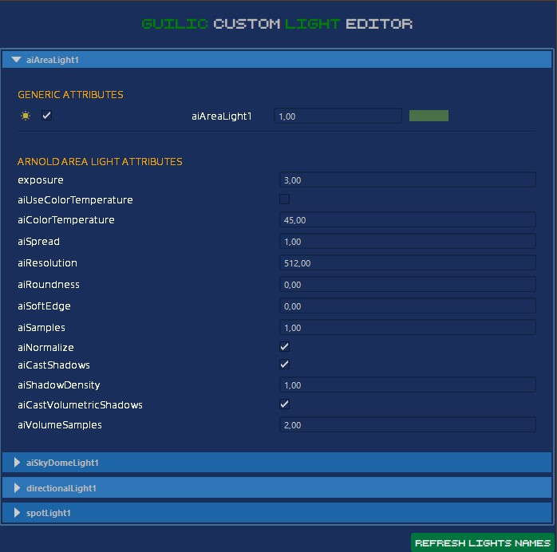

# 3 TOOLS FOR MAYA 2022
## TOOL1: Light Manager

The Maya Light Manager is a tool written in Maya that allows you to manage all the attributes of lights in your scene. With this tool, you can easily select lights, enable/disable lights, as well as control their properties, such as color, intensity, and radius.
The tool updates himself when adding / removing lights and all actions are synchronized with Maya UI.

Light Manager        |  
:-------------------------:   |
 |

### Features Light Manager

The Maya Light Manager comes with a range of features that can help you streamline your lighting workflow, including:

- **Light selection:** Quickly select any light in your scene.
- **Attribute editing:** Change any attribute of a selected light, including color, intensity, cone angle, and decay rate.
- **Customization:** Add/remove any attribute you want to appear in the interface.

## TOOL2: Light Attribute Copier

The Maya Light Attribute Copier Tool is a Python script that allows users to copy attributes from one light to other lights chosen by the user. The tool is customizable, meaning that users can filter the attributes they want to appear by editing the code.

Light Attribute Copier       |  
:-------------------------:   |
 |

### Usage Copy Light Attributes
<ol>
  <li>Select one light source</li>
  <li>Select the source light attributes you want to copy on the destination lights</li>
  <li>Select one or more lights for destination</li>
  <li>Click the copy button</li>
  <li>If you create a new light click on the update button to make it appear</li>
</ol>

## TOOL3: Auto Shader

The Maya Auto Shader tool is a Python script that allows users to easily attach texture maps to any object in the scene. The tool supports attaching base color, metalness, specular, and normal maps. Users can either specify a folder and a regex pattern to automatically find the textures, or they can choose the texture files individually.

Auto Shader      |  
:-------------------------:   |
 |

### Usage Auto Shader
<ol>
  <li>Choose a folder path that contains your texture maps.</li>
  <li>You can specify a regex pattern to filter your files(prefix, suffix, and keyword for the concerned map).</li>
  <li>If files are missing (pink square), you can choose the filepath by clicking on the square.</li>
  <li>Select objects you want to apply the textures on.</li>
  <li>Click on the Apply Textures button</li>
</ol>

## Installation

To install each one of the tools, follow these steps, which are common for any Python script:

1. Download the latest version from the [releases](https://github.com/gu1shermo/tools_maya_ati_m1) page. (`autoshader.py`,`light_manager.py`,`copy_lights.py`)
2. Open Maya and go to the Script Editor by selecting `Window > General Editors > Script Editor`.
3. In the Script Editor, open the Python script you want to install by selecting `File > Open Script...` and browsing to the file location.
4. Select all of the code in the file and drag it into the Python tab of the Script Editor.
5. Save the script to a shelf button by selecting File > Save Script to Shelf... and choosing a shelf to save the button to.

Once you've saved the script to a shelf button, you can easily access it from within Maya by clicking on the button on the shelf. You can also customize the button by right-clicking on it and selecting "Button Editor", where you can change the name, icon, and other properties of the button.

Note that the exact steps for installing a script may vary depending on the script and the version of Maya you are using. It's always a good idea to consult the documentation or instructions provided with the script to ensure that you are installing it correctly.
